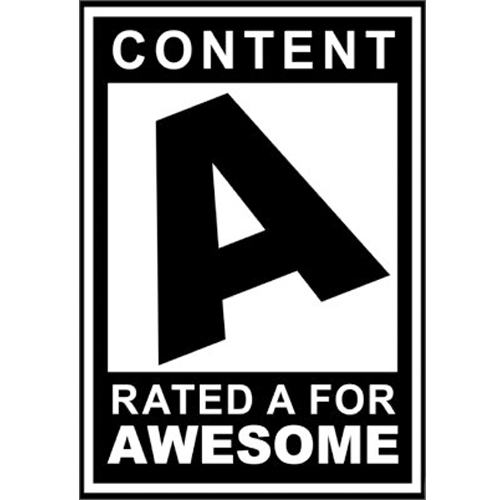
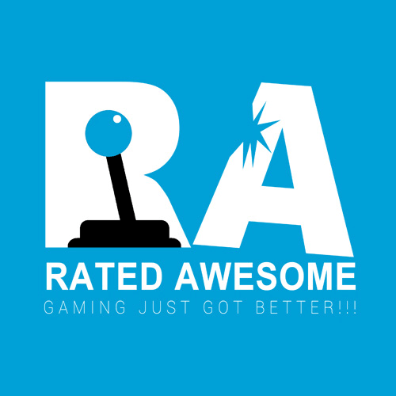
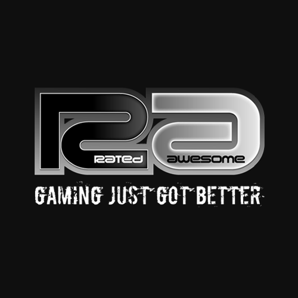
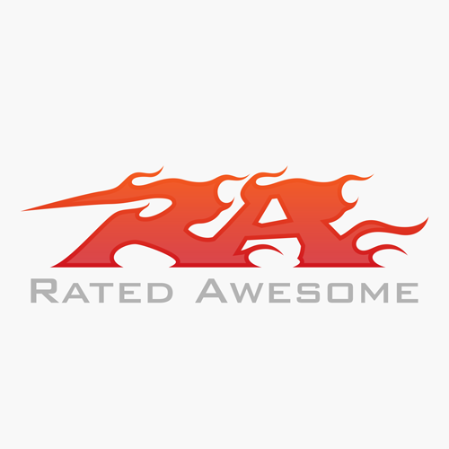
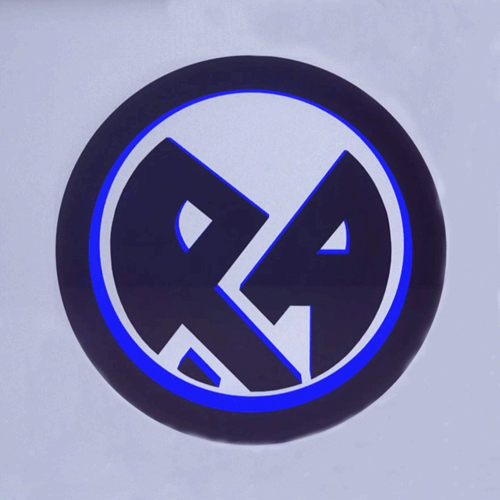
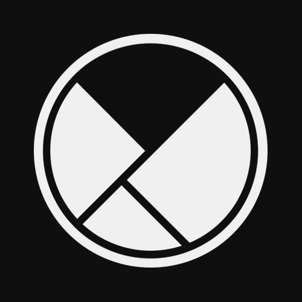
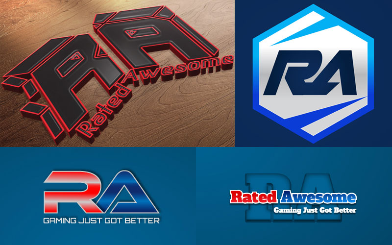
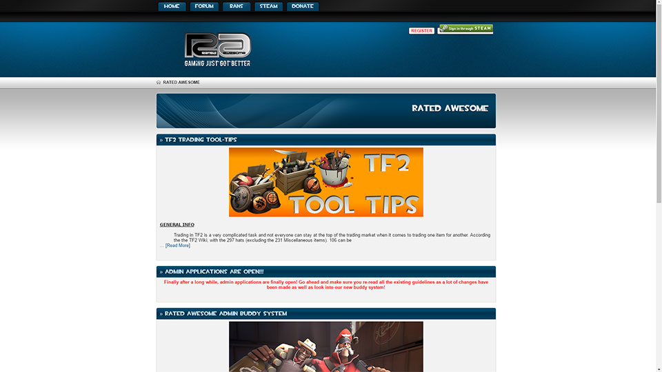
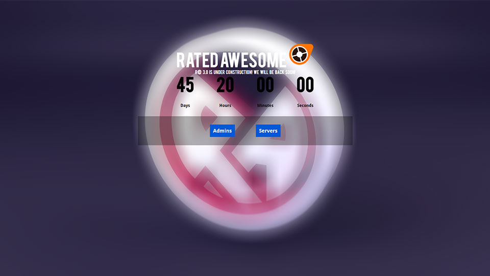

### Introduction
[Rated Awesome (RA)](https://ratedawesome.com/) is an online gaming community I started back in March of 2012. Obsessed with [Team Fortress 2](https://www.teamfortress.com/) at the time and it’s huge player base, RA was my attempt to get more involved with the community. What initially started as a side project to create a place for a few tightknit friends, grew into a massive player base across 4 different servers, 200+ players, and 1500 unique visitors a month. As with any big community, the rise in popularity and player growth came with its fair share of obstacles. This mostly involved general server maintenance and creating an online presence our players could associate with (branding, style, forums). In an attempt to keep costs low (instead of hiring help), I took it upon myself to tackle each of these obstacles and what came next were a series of erratic changes spanned out over the next couple of years. Below is the remnants of the evolution of Rated Awesome.

### Evolving Logo

Over the course of several years, I was **constantly** changing the logo design.

#### The First Logo (Mar 2012)

 
#### My Design (Dec 2012)

 
#### Paid Job (Feb 2013)

 
#### Paid Job 2 (Nov 2013)

 
#### New Artist (Jul 2014)

 
#### Current (Jan 2017)

 
#### Failed Designs

### The Website
Learning to design a proper website with matching schemes and complimentary typography was rough at first. Our website went through **A LOT** of changes. Unfortunately, these are the only snapshots I could recover from [The WayBack Machine](https://archive.org/web/).

#### Evolving Forums (Mar 2013)

 
#### The Shutdown (Jan 2014)

