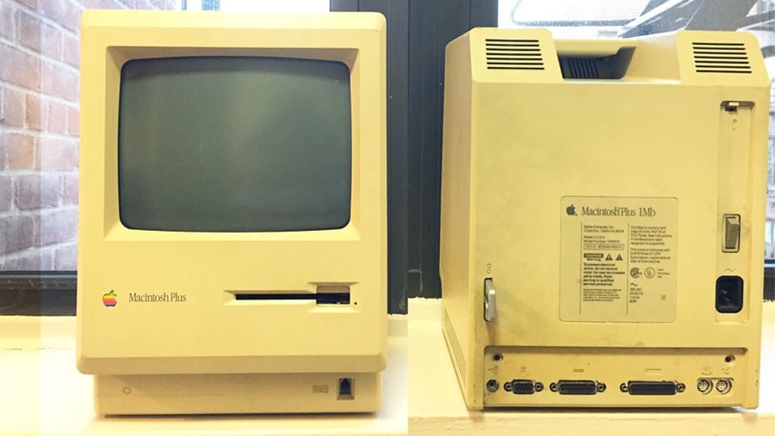
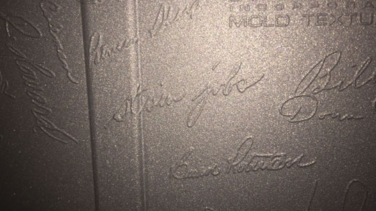
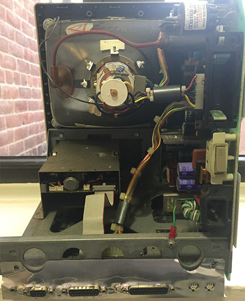
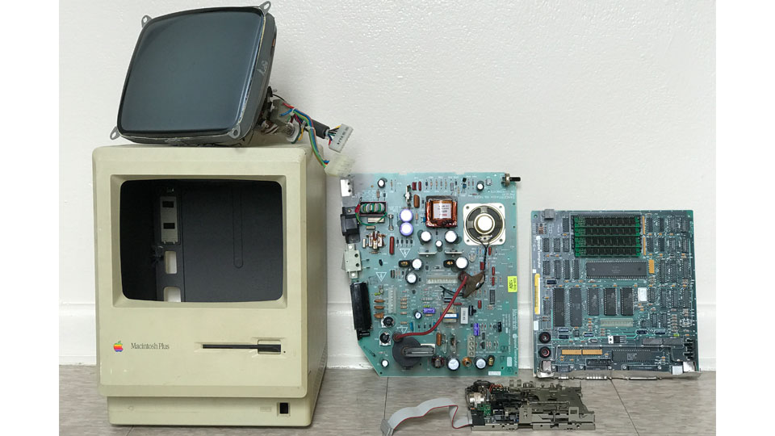
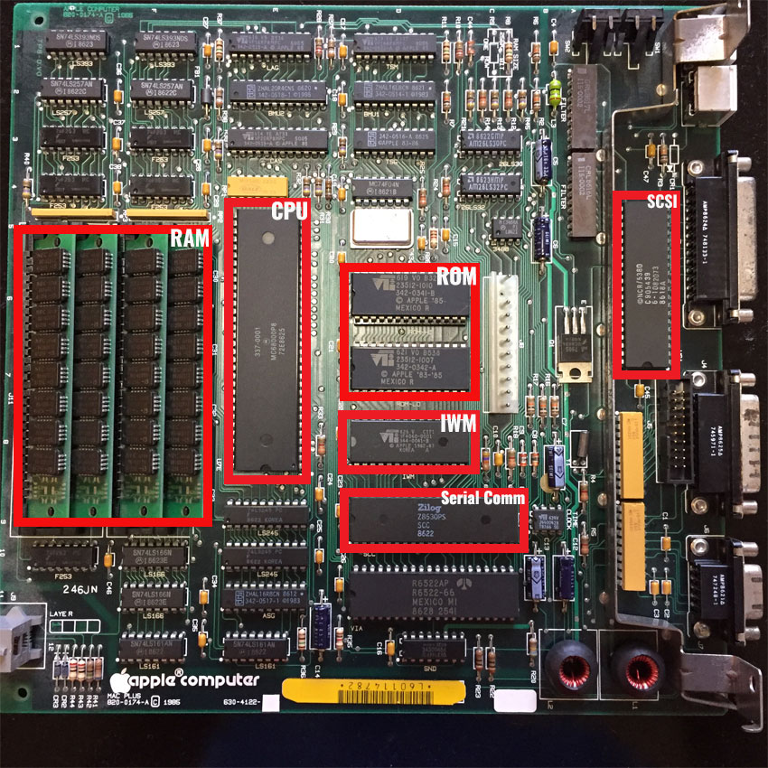
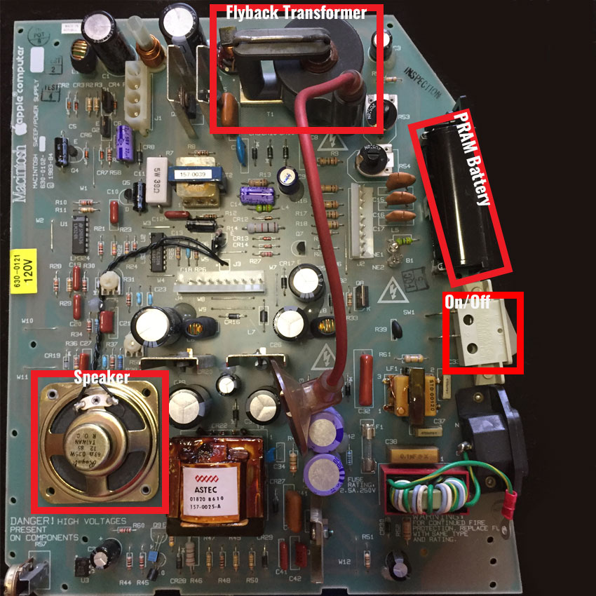
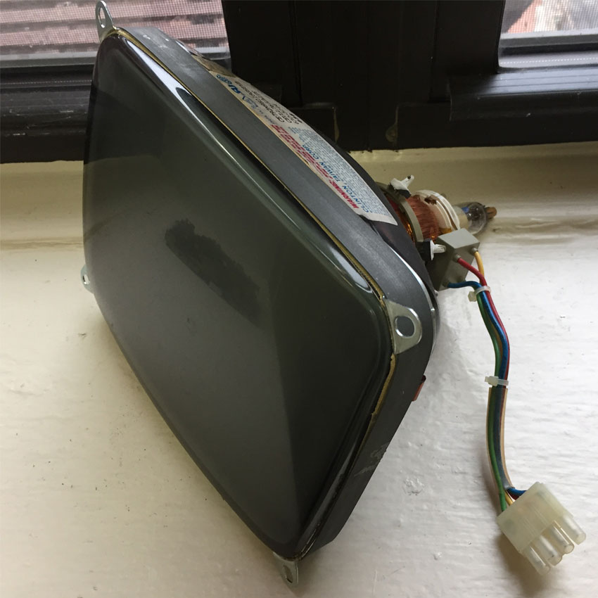
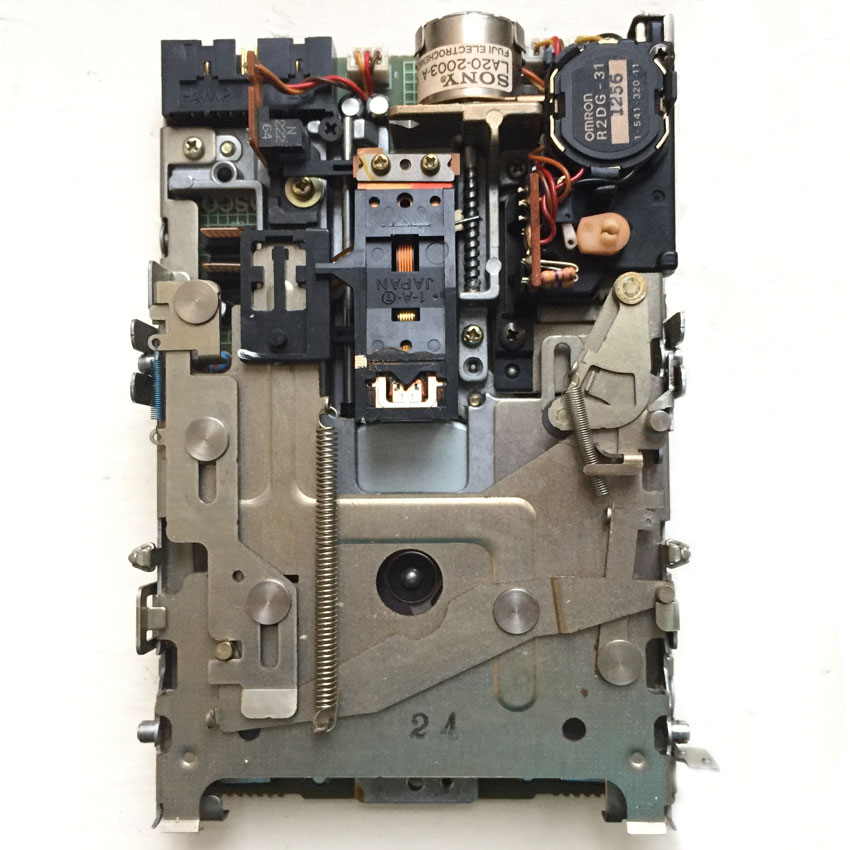

### Introduction
I’ve had this broken 1986 Macintosh Plus for a while now collecting dust underneath my bed. I wanted to fix it up and get it working, but something always got in the way. It was actually given to me a couple years back at a Maker Faire in 2013. I had stumbled into this vintage electronics booth and the plus sitting there. Fixing it up sounded like a good idea at the time so I took it off the owner's hands. This was 5 years ago...

Anyway, I've had a lot more time lately and decided to take it out of storage to work on. This will probably be a multi-part series. I can’t fit all my research into one post.

### Inside the Computer
Apple first introduced the Macintosh Plus in January of 1986. Following their original Macintosh line, the Plus retailed at $2599 and was largely seen as an upgrade, shipping with 1MB of RAM, a [SCSI (“scuzzy”) bus](https://en.wikipedia.org/wiki/SCSI), and other smaller improvements.

Using an online decoder with my Macintosh Plus’s serial number **F629063M0001A**, I found out that this computer was the 207th unit manufactured on the 29th week of 1986 *(~August)* in Fremont, CA. That is almost 7 months after it first debuted!

Opening the case was a **fucking** hassle. For some reason, Apple *opted in* to use special Torx T15 screws instead of standard flatheads. Even then, most standard T15 screwdrivers didn't work because they had to be able access the deeply recessed screws in the case. It took a while to find the right screwdriver.

With the case open and the [CRT monitor discharged](https://en.wikipedia.org/wiki/Cathode-ray_tube#Electric_shock), the first thing I did was take a picture of Steve Jobs’ signature. According to this [blog post](https://www.folklore.org/StoryView.py?project=Macintosh&story=Signing_Party.txt), in the early days of Apple, Steve Jobs encouraged the design team to consider themselves as artists building the Macintosh. As with any artist, it was only appropriate for them to sign their work which eventually got engraved into the final plastic molding of the case.

Looking inside, the computer seemed mostly intact. Despite some rust/corrosion near the PRAM battery slot and dust, the Plus was in fairly good shape.

From here, I decided to disassemble the entire unit so I could get rid the dust that had collected over the years. I read somewhere online that soaking the entire board in soapy water and then giving it time to properly dry worked well, and in some cases, even helped fix computer glitches. I ended up soaking the power supply, internal metal casing, and logic board (making sure to take out any removable IC's/wires). The floppy drive was cleaned using a can of compressed air and I ended up wiping down the CRT monitor and case with a wet towel.

### The Components

Feel free to skip over this section. This part is mostly for me to fanboy over some of the older chipsets. Some of the components are labeled in the picture.

#### The Logic Board

 
#### The Power Supply

 
#### CRT Monitor

 
#### The Floppy Drive

### Decisions, Decisions

Moving forward, I essentially had 2 options. Restoring the Plus to its original condition **OR** upgrading it with new parts.

Restoring it seemed like an obvious choice at first until I started calculating the cost of repair. Assuming all existing components worked properly, I was still looking at $200 in repair costs. This included buying a compatible keyboard and mouse, finding a working SCSI HD since the Plus had no permanent storage, and getting a copy of the original OS on a [double density floppy disk](https://en.wikipedia.org/wiki/Floppy_disk_format#Single_Sided.2C_Double_Density). The Plus’s floppy drive reads only double density disks which are grossly outdated and obsolete. If an issue did come up, however, with the logic/power board, that price could would jump to $300+. In the end it just didn't make sense to spend all that money working on something that could only run a very dated version of Mac OS.

So I arrived at my second choice; upgrading it with new parts. Looking around, I found [several](https://www.instructables.com/id/Making-ApplePi-Merging-a-Vintage-Macintosh-Plus-Wi/) [projects](https://medium.com/@trm42/raspberry-pi-2-macintosh-plus-raspintosh-cd2f6691fecf) [online](https://www.youtube.com/watch?v=1q-zmSzjZ8w) that had replaced the internals of the Plus with a Raspberry PI or other Single-Board Computer, but kept the original casing. This is the route I ended up taking.
