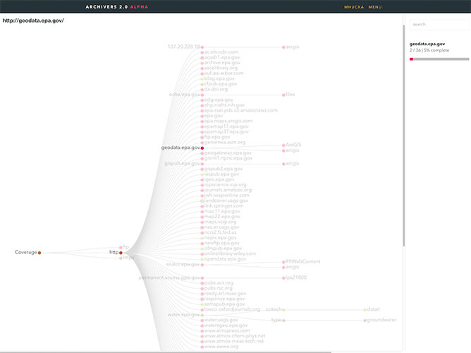

### Introduction
Over the past 3 months, as part of [Google Summer of Code 2017 (GSoC)](https://summerofcode.withgoogle.com/), I spent my time working with the [Environmental Data & Governance Initiative (EDGI)](https://envirodatagov.org/). EDGI is a network of scientists, professors, and other non-profits that came together in response to the Trump administration and the threat they posed to several environmental agencies and public resources. EDGI essentially took that threat as a call-to-action and since then has been working diligently as a team on developing tools and resources to help preserve environmental data.

Over the summer, I became a part of that team.

### Data Models
My project focused on data visualization. I was tasked with creating interactive graphs and models that would help users better visualize the data they were scraping/archiving off the internet. Using [D3](https://d3js.org/), I helped create a **Coverage Map** and a **DataRescue Map**.

#### Coverage Map
EDGI has been archiving data from public resources since December of last year. Previously, they had been using a tree to show coverage with each node delinating url pathing and then file structure. While this was fine at the time, as the data count went from tens to hundreds of thousands, it became *messy*. There was a disconnect between the information conveyed in the tree and what a user wanted to see.

My first couple of weeks were spent prototyping different models and obtaining feedback. I went through several variations of [Bilevel Partitions](https://bl.ocks.org/mbostock/5944371), [Icicle Trees](https://bl.ocks.org/mbostock/1005873), and [whatever this thing is](https://bl.ocks.org/mbostock/4063550) before finally settling on a [Sunburst Diagram](https://www.datavizcatalogue.com/methods/sunburst_diagram.html).

Sunburst Diagrams use concentric rings with divided arcs to show groups/categories with each layer denoting hierarchy. Digging further, I found a variation on the diagram called a [Sequence Sunburst by Kerry Rodden](https://bl.ocks.org/kerryrodden/766f8f6d31f645c39f488a0befa1e3c8) in D3 which became a solid base to make the coverage map.

After getting it to correctly convert/process a sample JSON dump of the coverage data, I started polishing the model and creating a standalone ReactJS component. There were several issues that came up during this time that slowed down progress including:

- **Color Schemes -** Initially, we used a qualitative color scheme and displayed archival rate when the user hovered over an arc. We found this to be suboptimal and instead opted into a sequential color scheme for the entire diagram.
- **Completion Rate -** Each node gave us two values: **numLeaves** and **numLeavesArchived**. Archival rate was calculated using **numLeavesArchived/numLeaves**. Based on user feedback, the issue was whether **numLeaves** should be the node’s parent value or it’s own.
- **Categorizing Data -** Initially, the data was separated by protocol (https, http, ftp). While this was informative, it wasn’t particularly useful. We tried to separating it by website, but that too ended up filtering out ~97% of generated sunburst sequences because they were too small to display. We eventually moved on to filetype.
- **React Integration -** This was probably the most annoying one. Both D3 and ReactJS are designed in such a way that they want to directly manipulate the DOM. Ofcourse, combining them means only one can.
- **ArcTween-ing -** Animating the diagram was challenging. Being new to D3, I had to figure out how to properly interpolate different arc lengths and animate the transitions between them.

#### DataRescue Map

While web monitoring and archiving are a large part of EDGI’s focus, the organization also hosts several [DataRescue events](https://envirodatagov.org/datarescue/) around the country with the goal of identifying and preserving different datasets. I always imagined it as a hackathon for archiving data.

Anyway, noticing that there was no effective way to view past events, I created a projection map of the United States highlighting interactive points across the country where the events took place. It was also directly integrated with the EDGI Airtable so the map updates live as new events come up. Working on the model came with it’s fair share of obstacles as well including:

- **Optimization -** This was a big one. A lot of the coordinate calculations, polygon rendering, and JSON processing for the map is dumped on the client. Decreasing the load time for the model became an issue and a lot of the testing involved alternating between using [TopoJSON](https://github.com/topojson/topojson) and [GeoJSON](https://geojson.org/) data.
- **Similar Datapoints -** Events held in locations < 30 miles apart became an issue because the points were impossible to distinguish from each other on the map. A proposed solution was to aggregate nearby coordinates and increase the radius of the generated circle.
- **Screen Size -** This became an issue for many people viewing across different screens/devices. Due to limitations in the Albers’ equal area-conic projection, the map couldn’t be stretched. This made it harder for mobile users in particular to see the details of individual events. Users also had a hard time noticing that the text below the projection was changing