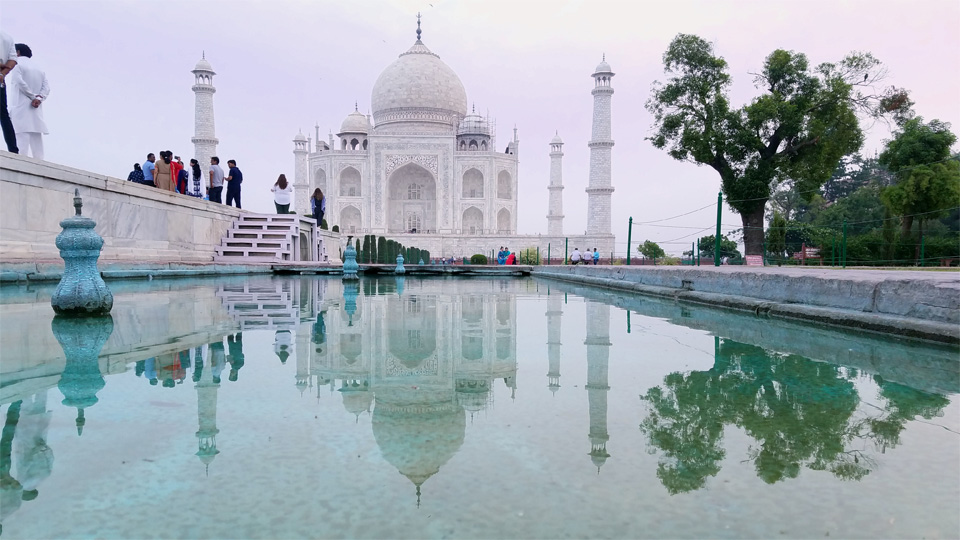

I went to India last month for a relatively short trip to visit my extended family living in Jaipur. It had been about 4 years since my last visit and although most of the city felt the same, Jaipur had gone through some major economic growth and urban development. There were a lot more things to do, places to visit, and restaurants were exploding in popularity; which brings me to my rant: most restaurants sucked.

My family and I had eaten at a different restaurant most nights we were there. We really didn’t want my grandma cooking dinner for 5 and it was usually very cheap (~$3 a meal). Living in a crowded city, we were presented with thousands of dining options. Because of this, a lot of restaurants would often try to stand out by offering a ton of variety. It wasn’t uncommon for us to get seated and look at a menu with 50+ items which presents itself to an old saying. Jack of all trades, master of none.

I've lately grown to be more skeptical of restaurants that offer large menu selections mostly because a kitchen staff can only consistently perfect a few dishes. Large menus would mean a variety of different orders and a likely decline in the overall quality of each dish. This problem was further compounded by the fact that most restaurants I ate at would often offer Mexican, Italian, and Chinese alongside Indian cuisine which meant a lot more variety in styles of cooking. Don’t get me wrong, the Indian food was amazing! It was everything else that was bad. The worst part of it all was that I felt that most patrons couldn't tell the difference.

Growing up in New York, I always felt like I had a good sense of what certain foods should and shouldn’t taste like. Living in a melting pot that is as big as NYC is, every culture is pretty equally represented in the restaurant scene. It wasn't just that the food in Jaipur was bad, it was that local patrons had nothing to compare it to. The worst offender was probably this extremely sweet enchilada I had. Almost like a candy bar. Enchiladas aren't supposed to be that sweet. Next time I visit, I'll probably just stick to Indian.

Anyway, that’s my short rant on the food in Jaipur. Also, here’s a cool picture of the Taj Mahal I took on the trip.

