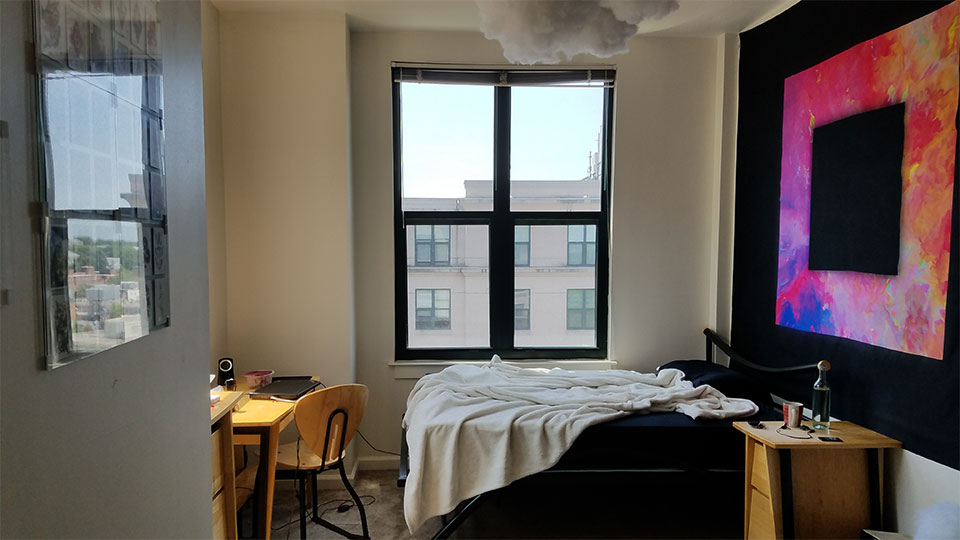

As my time in Maryland comes to a close, I can’t help but reminisce about all the fun I’ve had these past few months. One of the best things about moving back to College Park, Maryland was finally being able to live in an apartment with my own room/bathroom. Growing up in New York and moving for college, I’ve always had to share a room. Whether it was my sister for the better part of my childhood or my freshmen and sophomore year roommates.

But this past year was different. Living on my own, I was renting out a single room in a 4 bedroom suite with a personal bathroom. I somehow managed to luck out even further by getting a corner room on the top floor double the size of a traditional single!

It was perfect.

So I had to decorate it.

### Ceiling Lights

Adequate lighting was a top priority seeing as there was only a single dimly lit ceiling lamp in the center of the room. I wrote an [entire blog post](/blog/2017/diy-ceiling-lights/) on how I went about DIY-ing my own set of lights you can read about.

### The Couch

Buying a couch was also pretty important since the only seating in my room was a single chair next to my desk and my bed. I ended up buying a used Ikea BALKRAP off of craigslist that matched the wood finish of the lights and custom fitted it with RGB LED’s that react to sound.

<iframe src='https://www.youtube.com/embed/ZRr5c-0uuj4?end=31' width='711' height='400' frameborder='0' webkitAllowFullScreen mozallowfullscreen allowFullScreen></iframe>

### The Clouds

I discovered something online called a Cloud Lamp a few months before I moved in and I always wanted to make one. So I did. A [Youtube search](https://www.youtube.com/results?search_query=Cloud+Lamp) revealed hundreds of tutorials and it was essentially a bunch of paper lanterns with LED’s inside covered in cotton hanging from the ceiling. It also reacts to sound!

<iframe src='https://www.youtube.com/embed/ZRr5c-0uuj4?start=32&end=94' width='711' height='400' frameborder='0' webkitAllowFullScreen mozallowfullscreen allowFullScreen></iframe>

### Wall Art

No room would be complete without a bit of wall art. So I bought some! Most of this involved experimenting around to get the asthetic just right.

#### Playing Cards

[Playing Arts](https://playingarts.com/en) is an art collective that creates playing cards each designed by a unique artist. I really liked the design behind some of these cards and thought it would make for some great wall art. I bought a lot of photo frames from the dollar store, removed the casing and sandwiched several cards in between two pieces of glass creating a frameless frame which was then mounted on the wall.

#### Frames & Bullets

I had a lot of useless frames leftover after finishing the frameless cards display. Instead of throwing them out, I decided to hang them up near my door in a sort of abstract fashion. To add to the mystery, I placed several bullets on certain frames to form a pattern. See if you can try to make sense of it.

#### Stars

My bedroom ceiling back home was covered with glow-in-the-dark stars when I was a kid and I wanted that same experience here. I bought some adhesive stars online and plastered them above the frameless cards display. I was aiming towards an expanding universe type design.

#### The Tapestry

No apartment would be complete without a hanging tapestry. I bought this giant one designed by [Dorian Legret](https://www.instagram.com/dorianlegret/). He does some really cool work and I really liked the abstract glitch-art asthetic. It made the perfect backdrop above my bed.

#### Ukulele

I bought this ukulele my senior year of highschool. Putting it on a wall mount gave me more of an excuse to play it every now and then and was less of a hassle than taking it out of its casing everytime. It also made for some great wall art!

### The View

The best part, in my opinion, about living here these past two semesters was the view. Living on the top floor, I could see the whole campus outside my window. It was just perfect.

### The Room

Overall, I'm pretty happy with how everything turned out. Living here these past two semesters has been amazing.

#### Cozy Mornings

#### Trap House

<iframe src='https://www.youtube.com/embed/ZRr5c-0uuj4?start=95' width='711' height='400' frameborder='0' webkitAllowFullScreen mozallowfullscreen allowFullScreen></iframe>

I guess it's time to move out.

