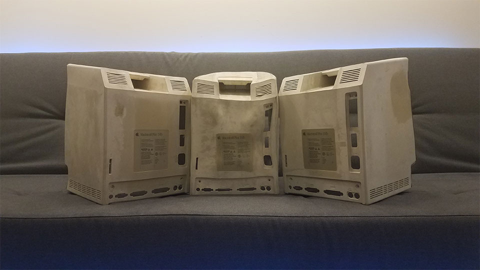

I figured I would give everyone a progress update on [The Plus Project](/blog/2017/the-plus-project-part-1/) I had begun to work on/write about last year. The problem is… there is none.

### Retr0bright

The next step in the process was to Retr0bright the casing. [Retr0bright](https://www.retr0bright.com/)-ing, if you haven’t heard, was a process developed in 2008 by a bunch of chemists, engineers, and retro hackers to turn the [yellow-ing/brown-ing of old computer hardware](https://www.retr0bright.com/after_eight_hours.jpg) that would often occur over time back to its original color (usually white). You can read more about it [here](https://www.retr0bright.com/), but the short version is that a mixture of hydrogen peroxide and an activating agent smeared on the casing combined with UV light for a few hours will actually reverse the aging process.

So that was the plan. I had all the materials ready to start Retr0bright-ing the Macintosh Plus when I came across this [video](https://www.youtube.com/watch?v=qZYbchvSUDY). The author conducted some experiments with different methods of whitening ABS Plastic (which is what most retrotech is made out of) and discovered that applying heat (around 160°F) to a mixture of H2O + H2O2 would actually give better results than traditional Retr0bright-ing methods and in a shorter amount of time. So I went about designing an experiment...

### Experiments & Mistakes

I bought some Salon Creme Developer online to serve as the hydrogen peroxide + activating agent mixture and poured it into a large plastic tub filled with water. The case was then submerged into the Retr0bright bath and with the help of an immersion heater, heated to 160°F. I used an IR Thermometer to monitor the temperature.

This is the part where I started running into a variety of problems and I’ll sort of list them here:

* For one, 160°F was NOT an ideal temperature to heat the mixture. ABS Plastic starts to become malleable around 155°F and it only rises with every degree. On my first trial run, the case became heavily deformed with entire sides concaved inward and melted in.
* Monitoring the temperature constantly was absolutely crucial to the process. Leaving the immersion heater on unmonitored for more than 5 minutes at a time would cause rapid rises in temperature sometimes peaking upwards of 190°F.
* Leaving the immersion heater on with the Macintosh Plus case inside the container often created issues. Since the heater was usually placed off to a single corner, the mixture in that corner would often be hotter than in the rest of the container. This temperature gradient transfered over to the case causing cracks/deformities on the side facing the heater.
* Putting any amount of pressure on the case over a long period time would cause minor bends even at lower temperatures (140°F/130°F).

I went through about 3 cases trying to get the Retr0bright to work correctly. Yup. That’s 3 Macintosh Plus’ I had to buy from Ebay, sell the internal components online, and then buy enough salon creme developer to Retr0bright them all. Although I ended up making most of my money back, destroying three Macintosh Plus cases wasn't my proudest moment. By the third one, however, the huge deformities that once occurred turned into barely noticeable imperfections. 

Here is a picture of my victims. May they rest in peace.

### Results

I ended up learning a lot throughout this process (even though at the sacrifice of three Macintosh Plus’). For one, I managed to cut down the Retr0bright time from ~8 to just under 3 hours with no damage to the item. Here are the steps you could take to roughly achieve the same thing:

1. Find a container (ideally plastic) slightly larger than the item you are about to Retr0bright and fill it up to the desired water level. This should either submerge the item completely or halfway.
2. Once it is filled, turn on and submerge the immersion heater until you reach a water temperature of 180°F and then pour in the Retr0bright. Make sure to mix the contents of the container so that the Retr0bright is evenly diluted and the temperature is uniform. I roughly used about 1 liter of Retr0bright for every 10 Liters of water, but this can vary on a case by case basis.
3. Wait for the temperature to reach 155F before submerging the item in.
4. Cover the container to prevent heat from escaping. Wait 10 minutes or until the temperature drops to 140°F (whichever comes first) and then take the item out to cool.
5. Lightly clean the case with a dry rag.
6. Reheat the Retr0bright bath to 155°F and repeat steps 3 to 6 until a desired color is achieved.
7. Finally, clean the case off thoroughly with water and dry.

Following these steps will pretty much ensure a uniform color restoration in under 3 hours.

Anyway, that’s pretty much my update on The Plus Project so far. Moving forward, I have no idea what’s going to happen. I would like to eventually buy another Macintosh Plus and restore it properly, but I’m not really sure when I’ll have the time and/or funds to do that in the future. So for now this is it. Thanks for reading!
