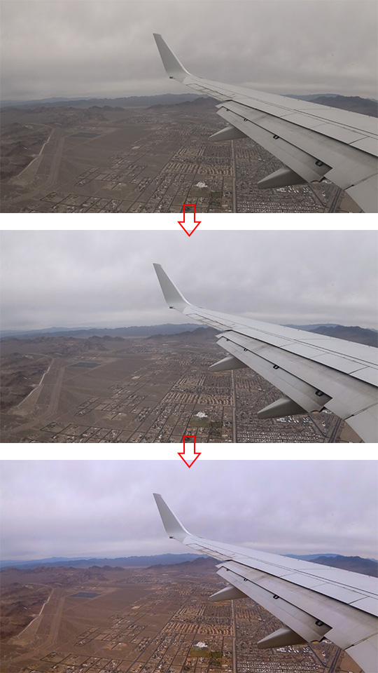
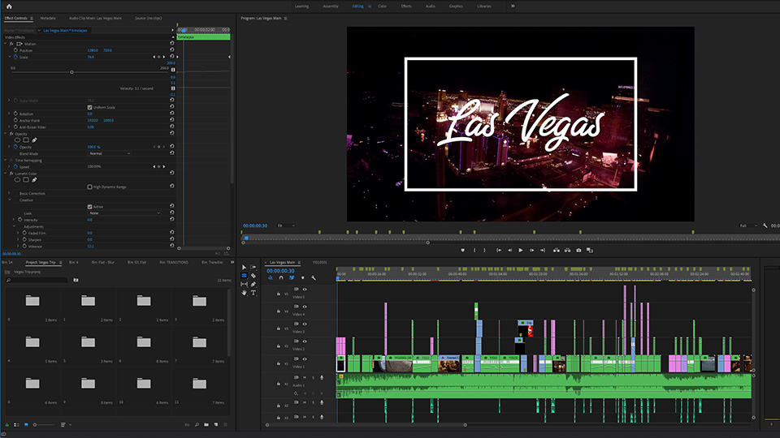

This blog entry is a behind-the-scenes analysis of the travel video I published on Youtube a couple days ago and a hindsight look at the things I think I did well, the things that went awry, and everything in between.

For reference, everything was shot on either my Yi 4K+ Action Camera or cell phone camera footage I scraped together. In total, the entire project took me about ~30 hours to complete, the first 10 of which were spent learning the ins/outs of editing in Adobe Premiere.

 <iframe src='https://www.youtube.com/embed/UqQYfoxpLEE' width='711' height='400' frameborder='0' webkitAllowFullScreen mozallowfullscreen allowFullScreen></iframe>

I’ve always had a secret interest in film composition and going to Las Vegas to celebrate my friend’s birthday gave me an opportunity to explore it. Looking back, I wasn’t satisfied with how this video turned out. From the footage that I had shot to the specific cuts that I used, I think there was a lot of room for improvement and I certainly made a lot of mistakes putting it together.

### Unplanned Shots

To be fair, I sort of went into this kind of blind. I didn’t have a specific goal or end product in mind, just that I wanted to create a video reflecting my time in Las Vegas. Because of this and the fact that I was shooting everything handheld, 90% of the footage I ended up with became unusable. Here were some of the problems I came across during my edit:

* <b>Shaky Footage -</b> Because my camera was attached to a handheld grip combined with a lack of focus, most of my footage ended up really shaky. It felt like I was in mid-seizure during every shot. Even with electronic stabilization in post, the video still looked really blurry and distorted.
  
* <b>Lighting -</b> I never ended up taking into account the lighting of each area I was filming in and because of this some of my footage became overexposed while others suffered from noise/graininess due to low light.
  
* <b>Useless Shots -</b> I never planned any of my shots from the get-go and just filmed what I thought was interesting at the time. This ended up hurting me during the edit as I hadn’t captured any of the important moments I wanted to and the ones that did make it in had bad angles and made for rough transitions.

Honestly, most of the trouble I ran into could’ve been fixed if I had just planned my shots! Planning in advance would’ve allowed me to think about the moments I wanted to highlight, the lighting and angles of every shot, and with a steady hand (or a gimbal), it would’ve made for a less frustrating edit. Having a clear vision going in was definitely the biggest takeaway from this experience.

### Transitions and Colors

Despite all the hiccups in post, there were definitely certain aspects of the edit that I think I did well in (for a first attempt anyway). On top of that list would be custom transitions.

Piecing together the footage in my timeline, I was initially transitioning from one scene to the next with a simple cut. Although effective, it quickly became jarring to watch, especially with scenes cutting from standstill shots to ones with motion. Custom transitions like zooms, wipes, and blurs helped alleviate this problem by adding motion in between the cuts making them appear more seamless and also gave a stylistic flair to the edit. It also additionally helped detract from the inherent shakiness in the footage.

Color grading was another aspect of the final cut I think I managed to do a decent job in. I initially had shot everything in a flat color profile because I had wanted the flexibility to adjust the style of the video in post, but had no sense of direction on the aesthetic I was aiming for. I ended up defaulting to the classic orange and teal look that many Hollywood movies mimic today as a baseline for my color grade. Here is an example of the changes the footage went through as I was color correcting and then color grading the flat image:

This ended up working out pretty well and although I didn’t strictly adhere to the baseline profile in other shots, the overall look managed to match the aesthetic I had in mind.

Editing this video was definitely a long and arduous process, but I learned a lot from the experience that I could apply to videos I make going forward!

